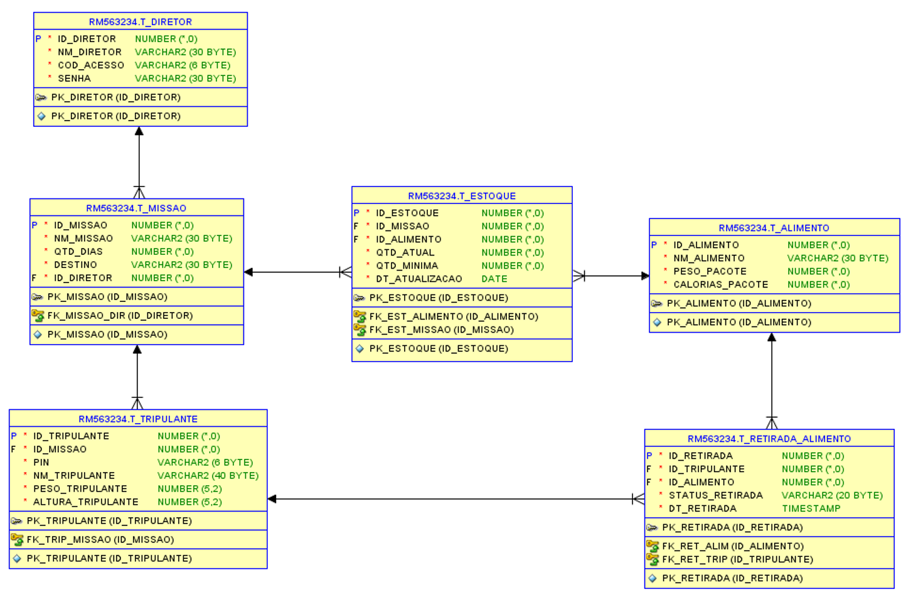
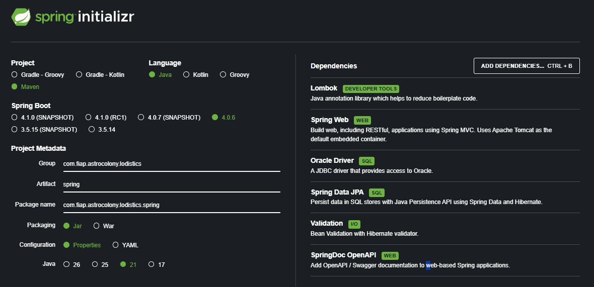

# 🚀 AstroColony API

## 📖 Sobre o Projeto

O AstroColony Logistics (ACL) é uma aplicação desenvolvida em Java com Spring Boot para simular o gerenciamento logístico de uma colônia espacial. O sistema permite controlar recursos essenciais, como alimentos, tripulantes e missões, garantindo rastreabilidade e organização das operações realizadas durante uma missão.

O projeto foi criado com o objetivo de aplicar conceitos fundamentais da disciplina de Java, incluindo Programação Orientada a Objetos (POO), desenvolvimento de APIs REST, persistência de dados com JPA/Hibernate, validações de regras de negócio e integração com banco de dados Oracle.

Por meio do sistema, é possível cadastrar e gerenciar tripulantes, diretores de voo, missões e alimentos, além de registrar o histórico de consumo de recursos. Dessa forma, o AstroColony Logistics demonstra na prática a construção de uma aplicação backend completa utilizando as principais tecnologias do ecossistema Java.

O projeto implementa conceitos de:

- Programação Orientada a Objetos (POO)
- Arquitetura em Camadas
- API REST
- Persistência com JPA/Hibernate
- Banco de Dados Oracle
- Validações de negócio
- Relacionamentos entre entidades
- Documentação com Swagger/OpenAPI

---

# 🎯 Objetivo do Projeto

O AstroColony tem como foco auxiliar o gerenciamento de recursos necessários para missões espaciais.

A aplicação permite:

- Cadastro de Tripulantes
- Cadastro de Diretores de Voo
- Planejamento de Missões
- Controle de Alimentos
- Registro de Consumo Alimentar
- Controle de Status Operacionais
- Consulta e rastreamento de informações críticas para a missão

---

# 🏗️ Arquitetura da Aplicação

A aplicação segue uma arquitetura em camadas:

```text
Controller
    ↓
Service
    ↓
Repository
    ↓
Banco Oracle
```

Cada camada possui responsabilidades específicas:

### Controller

Responsável por receber as requisições HTTP.

### Service

Contém as regras de negócio.

### Repository

Realiza a comunicação com o banco de dados através do Spring Data JPA.

### Banco de Dados

Persistência dos dados utilizando Oracle Database.

---

# 🛠️ Tecnologias Utilizadas

| Tecnologia | Versão |
|------------|---------|
| Java | 21 |
| Spring Boot | 4 |
| Spring Data JPA | 4 |
| Hibernate | 7 |
| Oracle Database | 19c |
| Maven | 3.9+ |
| Lombok | Última |
| Swagger/OpenAPI | 3 |
| Postman | Testes |

---

# 📂 Estrutura do Projeto

```text
src
 ├── controller
 ├── service
 ├── repository
 ├── entity
 ├── dto
 ├── exception
 ├── enums
 └── config
```

---

# 🗄️ Modelo de Dados

O sistema é composto pelas seguintes entidades:

## 👨‍🚀 Tripulante

Representa os astronautas participantes das missões.

### Principais atributos

- idTripulante
- nmTripulante
- pesoTripulante
- altura
- pin
- senha
- status

---

## 👨‍✈️ Diretor de Voo

Responsável por supervisionar e autorizar missões.

### Principais atributos

- idDiretorVoo
- nmDiretor
- emailDiretor
- senhaDiretor
- status

---

## 🚀 Missão

Representa uma operação espacial.

### Principais atributos

- idMissao
- nmMissao
- destino
- qtdDias
- qtdAlimento
- statusMissao

### Relacionamentos

- 1 Diretor de Voo
- N Tripulantes
- N Alimentos

---

## 🍱 Alimento

Controla os alimentos disponíveis para as missões.

### Principais atributos

- idAlimento
- nmAlimento
- pesoAlimento
- kcal

### Relacionamento

Muitos alimentos podem estar associados a muitas missões.

```java
@ManyToMany
private List<Missao> missao;
```

---

## 📊 Histórico de Consumo

Registra o consumo de alimentos pelos tripulantes.

### Principais atributos

- idHistorico
- qtdConsumida
- alimento
- tripulante

---

# 🔗 Relacionamentos

```text
DiretorVoo
     │
     │ 1
     ▼
 Missao
   │  ▲
   │  │
   ▼  │
Tripulante

Missao
  ▲
  │
  ▼
Alimento

Tripulante
   │
   ▼
HistoricoConsumo
   ▲
   │
Alimento
```

---

# ⚙️ Configuração do Ambiente

## Pré-requisitos

Instalar:

- Java 21
- Maven
- Oracle Database
- Git
- Postman

---

# 🔧 Configuração do Banco Oracle

Arquivo:

```properties
src/main/resources/application.properties
```

```properties
spring.application.name=javaspg

spring.datasource.url=jdbc:oracle:thin:@oracle.fiap.com.br:1521:ORCL
spring.datasource.username=${USER_DB_ORACLE}
spring.datasource.password=${PASSWORD_DB_ORACLE}

spring.jpa.hibernate.ddl-auto=update
spring.jpa.show-sql=true
spring.jpa.database-platform=org.hibernate.dialect.OracleDialect
```

---

# 📥 Clonando o Projeto

```bash
git clone https://github.com/seu-repositorio/astrocolony.git
```

Entrar na pasta:

```bash
cd astrocolony
```

---

# ▶️ Executando a Aplicação

Compilar:

```bash
mvn clean install
```

Executar:

```bash
mvn spring-boot:run
```

ou

```bash
java -jar target/spring.jar
```

---

# 📚 Swagger

Após iniciar a aplicação:

```text
http://localhost:8080/swagger-ui.html
```

ou

```text
http://localhost:8080/swagger-ui/index.html
```

---

# 🔍 Principais Endpoints

---

# 👨‍🚀 Tripulantes

## Criar Tripulante

### POST

```http
POST /tripulantes
```

### Request

```json
{
    "nmTripulante": "Jonas Santos",
    "pesoTripulante": 66.0,
    "altura": 1.68,
    "senha": "eli14726"
}
```

---

## Buscar Tripulante por PIN

### GET

```http
GET /tripulantes/buscar-por-pin/TRIP-79586498
```

---

## Alterar Status do Tripulante

### PUT

```http
PUT /tripulantes/mudar-status
```

```json
{
    "pin": "TRIP-79586498",
    "status": "DESCANSO"
}
```

---

## Login de Tripulante

### POST

```http
POST /tripulantes/login
```

```json
{
    "emailOrPin": "TRIP-27915608",
    "senha": "pedro123"
}
```

---

# 👨‍✈️ Diretor de Voo

## Criar Diretor

### POST

```http
POST /diretor-voo
```

```json
{
    "nmDiretor": "Jonas Santos",
    "emailDiretor": "jonas@email.com",
    "senhaDiretor": "098765"
}
```

---

## Login Diretor

### POST

```http
POST /diretor-voo/login
```

```json
{
    "emailOrPin": "pedro@email.com",
    "senha": "123456"
}
```

---

# 🚀 Missões

## Criar Missão

### POST

```http
POST /missoes
```

### Request

```json
{
  "nmMissao": "Missão Lua",
  "destino": "Lua",
  "qtdDias": 60,
  "qtdAlimento": 130.58,
  "idDiretorVoo": 2,
  "idsTripulantes": [1,2],
  "statusMissao": "EM_ANALISE"
}
```

---

## Buscar Missão por ID

### GET

```http
GET /missoes/1
```

---

## Buscar Missões por Status

### GET

```http
GET /missoes/status/EM_ANALISE?page=0&size=10
```

---

## Iniciar Missão

### PUT

```http
PUT /missoes/iniciar-missao/1
```

---

# 🍱 Alimentos

## Cadastrar Alimento

### POST

```http
POST /alimentos
```

```json
{
    "nmAlimento": "Feijão Enlatado",
    "pesoAlimento": 0.500,
    "kcal": 150,
    "missao": [1]
}
```

---

## Buscar Todos os Alimentos

### GET

```http
GET /alimentos?page=0&size=10
```

---

## Buscar Alimento por ID

### GET

```http
GET /alimentos/buscar-por-?id=3
```

---

# 📊 Histórico de Consumo

## Registrar Consumo

### POST

```http
POST /historico-consumo
```

```json
{
    "idTripulante": 1,
    "idAlimento": 1
}
```

---

# 🧪 Testes da API

Todos os endpoints foram testados utilizando:

- Postman
- Swagger UI

Coleção disponível:

```text
AstroColony.postman_collection.json
```

A coleção contém todos os endpoints desenvolvidos durante o projeto.

---

# ⚠️ Regras de Negócio Implementadas

### Tripulantes

- Não podem ser criados com informações inválidas.
- Possuem PIN único para identificação.
- Possuem status operacional.

### Missões

- Necessitam de Diretor de Voo.
- Possuem controle de status.
- Possuem controle de alimentos.
- Possuem controle de tripulantes.

### Alimentos

- Podem ser vinculados a múltiplas missões.
- Possuem controle de peso.
- Possuem controle calórico.

### Histórico de Consumo

- Registra qual tripulante consumiu determinado alimento.
- Armazena quantidade consumida.
- Mantém rastreabilidade dos recursos da missão.

---

# 📈 Possíveis Evoluções Futuras

- Autenticação JWT
- Controle de permissões
- Dockerização
- Deploy em Azure
- Integração com RabbitMQ
- Monitoramento com Prometheus
- Observabilidade com Grafana
- Pipeline CI/CD
- Testes automatizados
- Microsserviços

---

# 👨‍💻 Desenvolvedor

**Pedro Ferreira**

Projeto desenvolvido para fins acadêmicos no curso de Engenharia de Software da FIAP.

---

# 🏆 Conclusão

O AstroColony API demonstra a aplicação prática de conceitos fundamentais de desenvolvimento backend utilizando Java e Spring Boot, contemplando modelagem de entidades, persistência de dados, construção de APIs REST, regras de negócio e integração com banco Oracle.

O projeto simula um cenário real de gerenciamento logístico para missões espaciais, oferecendo uma solução organizada, escalável e alinhada às boas práticas de desenvolvimento de software.

---


## Prints do projeto






---

## Link

Link do video: https://youtu.be/LLzfU6it4hU